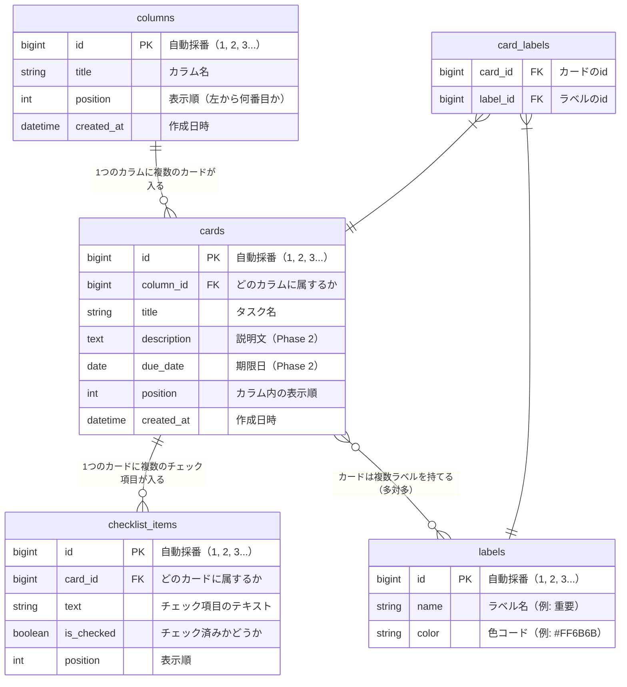

# データベース設計書

## タスク管理アプリ（Trello風）

| 項目 | 内容 |
|------|------|
| 作成日 | 2026-05-11 |
| バージョン | 1.0 |
| 作成者 | yusu |
| ステータス | 作成中 |

---

## 1. テーブル一覧

| テーブル | 日本語名 | 説明 |
|----------|----------|------|
| columns | カラム | 「Todo」「進行中」「完了」などの列 |
| cards | カード | 各タスク |
| labels | ラベル | 色ラベル（Phase 3） |
| card_labels | カード×ラベル | カードとラベルの対応（中間テーブル） |
| checklist_items | チェックリスト | カード内のサブタスク（Phase 3） |

---

## 2. ER図



---

## 3. テーブル詳細

### columns（カラム）

| カラム名 | 型 | 必須 | 説明 |
|----------|----|------|------|
| id | BIGSERIAL | ✓ | 主キー（自動採番） |
| title | VARCHAR | ✓ | カラム名 |
| position | INTEGER | ✓ | 表示順（左から何番目か） |
| created_at | TIMESTAMP | ✓ | 作成日時 |

> **BIGSERIAL とは？** PostgreSQL がレコードを追加するたびに自動で 1, 2, 3... と番号を振ってくれる型。Java側では `Long` 型として扱う。

### cards（カード）

| カラム名 | 型 | 必須 | 説明 |
|----------|----|------|------|
| id | BIGSERIAL | ✓ | 主キー（自動採番） |
| column_id | BIGINT | ✓ | 外部キー（columnsのid） |
| title | VARCHAR | ✓ | タスク名 |
| description | TEXT | | 説明文（Phase 2） |
| due_date | DATE | | 期限日（Phase 2） |
| position | INTEGER | ✓ | カラム内の表示順 |
| created_at | TIMESTAMP | ✓ | 作成日時 |

### labels（ラベル）※Phase 3

| カラム名 | 型 | 必須 | 説明 |
|----------|----|------|------|
| id | BIGSERIAL | ✓ | 主キー（自動採番） |
| name | VARCHAR | ✓ | ラベル名（例: 重要） |
| color | VARCHAR | ✓ | 色コード（例: #FF6B6B） |

### card_labels（カードとラベルの中間テーブル）※Phase 3

| カラム名 | 型 | 必須 | 説明 |
|----------|----|------|------|
| card_id | BIGINT | ✓ | 外部キー（cardsのid） |
| label_id | BIGINT | ✓ | 外部キー（labelsのid） |

### checklist_items（チェックリスト）※Phase 3

| カラム名 | 型 | 必須 | 説明 |
|----------|----|------|------|
| id | BIGSERIAL | ✓ | 主キー（自動採番） |
| card_id | BIGINT | ✓ | 外部キー（cardsのid） |
| text | VARCHAR | ✓ | チェック項目のテキスト |
| is_checked | BOOLEAN | ✓ | チェック済みかどうか |
| position | INTEGER | ✓ | 表示順 |

---

## 4. テーブル間のリレーション

### 1対多（1:N）

```
columns 1 ──────── N cards
  └── 1つのカラムに複数のカードが入る

cards 1 ──────── N checklist_items
  └── 1つのカードに複数のチェック項目が入る
```

### 多対多（N:M）

カードとラベルは「多対多」の関係。`card_labels` という中間テーブルを挟む。

```
カード「課題を終わらせる」→ ラベル「重要」「スクール」
カード「買い物する」       → ラベル「重要」

ラベル「重要」 → カード「課題を終わらせる」「買い物する」
```

| card_id | label_id |
|---------|----------|
| card-1  | label-1  |
| card-1  | label-2  |
| card-2  | label-1  |

---

## 5. APIエンドポイント設計

フロントエンドとバックエンドのやりとりを定義する。

### カラム

| メソッド | エンドポイント | 処理 |
|----------|----------------|------|
| GET | `/api/columns` | カラム一覧を取得（カード含む） |
| POST | `/api/columns` | カラムを新規作成 |
| PATCH | `/api/columns/:id` | カラム名・順番を更新 |
| DELETE | `/api/columns/:id` | カラムを削除（カードも削除） |

### カード

| メソッド | エンドポイント | 処理 |
|----------|----------------|------|
| POST | `/api/cards` | カードを新規作成 |
| PATCH | `/api/cards/:id` | カードの内容・所属カラム・順番を更新 |
| DELETE | `/api/cards/:id` | カードを削除 |

### レスポンス例（GET /api/columns）

```json
[
  {
    "id": 1,
    "title": "Todo",
    "position": 0,
    "cards": [
      {
        "id": 1,
        "title": "スクールの課題を終わらせる",
        "description": "",
        "due_date": null,
        "position": 0
      }
    ]
  }
]
```
