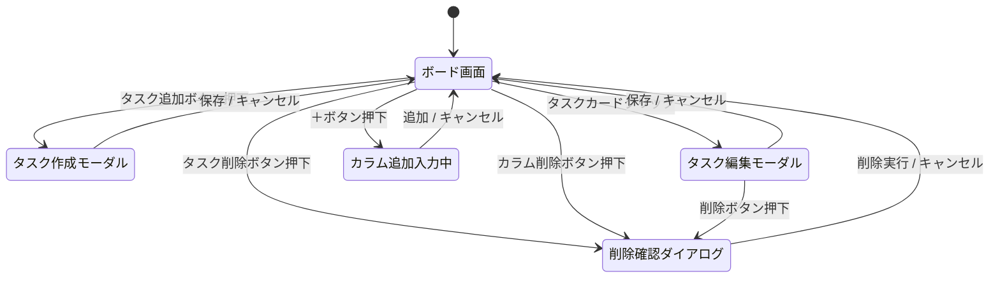
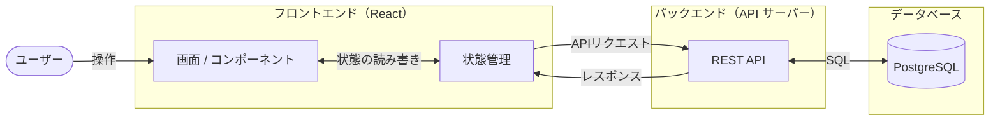
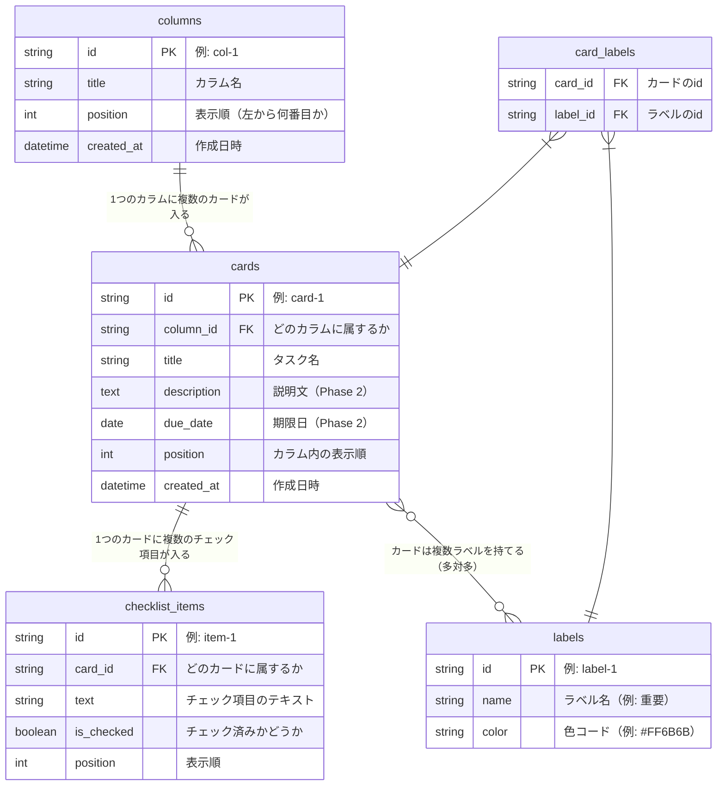

# システム設計書

## タスク管理アプリ（Trello風）

| 項目 | 内容 |
|------|------|
| 作成日 | 2026-05-08 |
| バージョン | 1.0 |
| 作成者 | yusu |

---

## 1. 画面遷移図

このアプリは1画面で完結するため、「ページ移動」ではなく「画面の状態変化」で表現する。



---

## 2. データフロー図

ユーザーの操作がどのようにデータとして流れるかを示す。



---

## 3. ER図（テーブル設計）

### 概要

| テーブル | 日本語名 | 説明 |
|----------|----------|------|
| columns | カラム | 「Todo」「進行中」「完了」などの列 |
| cards | カード | 各タスク |
| labels | ラベル | 色ラベル（Phase 3） |
| card_labels | カード×ラベル | カードとラベルの対応（中間テーブル） |
| checklist_items | チェックリスト | カード内のサブタスク（Phase 3） |

### ER図



### 多対多（N:M）について

カードとラベルは「多対多」の関係。

```
カード「課題を終わらせる」→ ラベル「重要」「スクール」
カード「買い物する」       → ラベル「重要」

ラベル「重要」 → カード「課題を終わらせる」「買い物する」
```

1つの表では表現できないため、`card_labels` という**中間テーブル**を挟む。

| card_id | label_id |
|---------|----------|
| card-1  | label-1  |
| card-1  | label-2  |
| card-2  | label-1  |

---

## 4. APIエンドポイント設計

フロントエンドとバックエンドのやりとりを定義する。

### カラム

| メソッド | エンドポイント | 処理 |
|----------|----------------|------|
| GET | `/api/columns` | カラム一覧を取得（カード含む） |
| POST | `/api/columns` | カラムを新規作成 |
| PATCH | `/api/columns/:id` | カラム名・順番を更新 |
| DELETE | `/api/columns/:id` | カラムを削除（カードも削除） |

### カード

| メソッド | エンドポイント | 処理 |
|----------|----------------|------|
| POST | `/api/cards` | カードを新規作成 |
| PATCH | `/api/cards/:id` | カードの内容・所属カラム・順番を更新 |
| DELETE | `/api/cards/:id` | カードを削除 |

### レスポンス例（GET /api/columns）

```json
[
  {
    "id": "col-1",
    "title": "Todo",
    "position": 0,
    "cards": [
      {
        "id": "card-1",
        "title": "スクールの課題を終わらせる",
        "description": "",
        "due_date": null,
        "position": 0
      }
    ]
  }
]
```

---

## 5. 技術スタック（バックエンド含む）

| レイヤー | 技術 | 役割 |
|----------|------|------|
| フロントエンド | React + Vite | 画面の描画 |
| バックエンド | Node.js + Express | APIサーバー |
| データベース | PostgreSQL | データの永続化 |
| ORM | Prisma | JavaScriptからDBを操作する |
| バージョン管理 | Git / GitHub | コード管理 |

### なぜこの構成か

- **Node.js + Express**：JavaScriptのままバックエンドを書けるため、フロントとの言語の切り替えが不要
- **PostgreSQL**：業界標準のリレーショナルDB。無料で使えて実績が豊富
- **Prisma**：SQLを直接書かずに、JavaScriptでDBを操作できる。型安全で初学者にもミスが少ない
