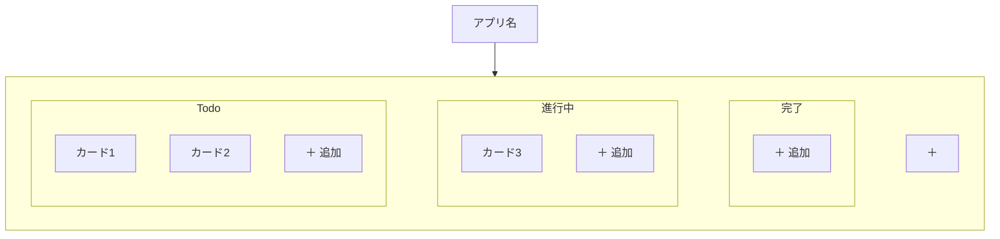
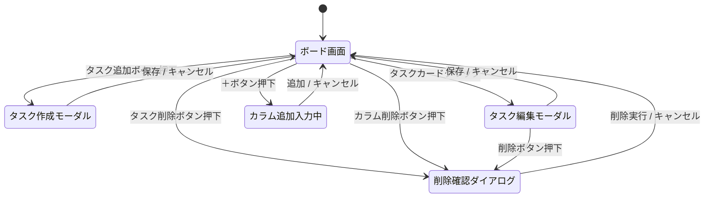
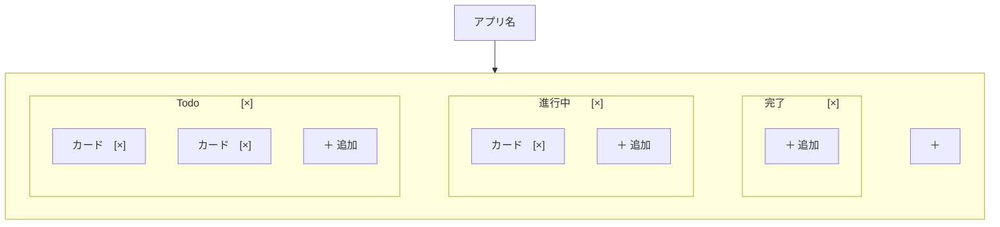
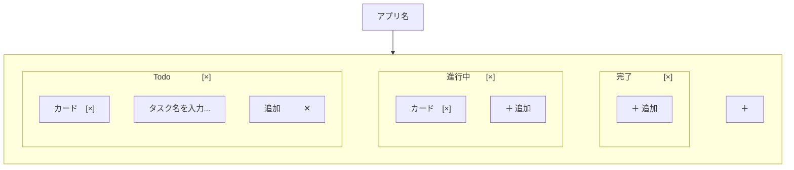
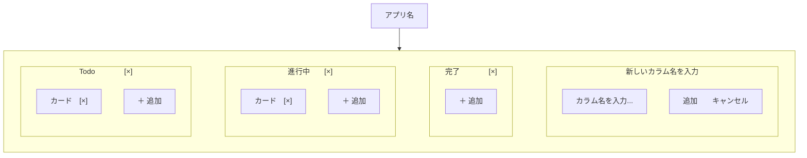
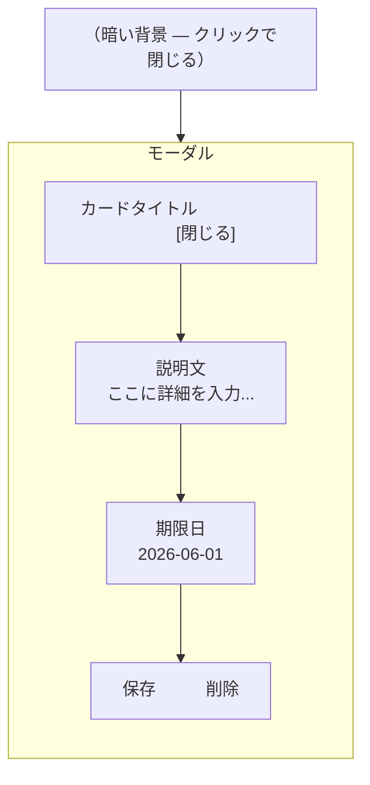

# 要件定義書

## タスク管理アプリ（Trello風）

| 項目 | 内容 |
|------|------|
| 作成日 | 2026-05-08 |
| バージョン | 1.4 |
| 作成者 | yusu |
| ステータス | 作成中 |

---

## 改訂履歴

| バージョン | 日付 | 変更者 | 変更内容 |
|-----------|------|--------|---------|
| 1.0 | 2026-05-08 | yusu | 初版作成 |
| 1.1 | 2026-05-08 | yusu | 画面構成図を修正 |
| 1.2 | 2026-05-08 | yusu | ペルソナ・制約条件・前提条件を追加 |
| 1.3 | 2026-05-08 | yusu | デザイン方針を追加 |
| 1.4 | 2026-05-08 | yusu | ワイヤーフレームを追加 |

---

## 1. プロジェクト概要

### 目的
Trelloを参考にした、カンバン形式のタスク管理Webアプリを作成する。
カードをカラム間で移動させることでタスクの進捗を視覚的に管理できるようにする。

### 背景
- プログラミングスクール（RaiseTech）の課題として作成
- Webアプリケーション開発の基礎を習得することが目的
- 既存のツールはUIが合わず継続利用できなかった経験があるため、自分好みのUIで作成する

---

## 2. 前提条件・制約事項

### 前提条件

- サーバーやデータベースは使用しない（フロントエンドのみで完結させる）
- 開発環境は Windows PC + Cursor エディタとする

### 制約事項

- バックエンド（サーバー側の処理）は実装しない
- ユーザー認証（ログイン機能）は実装しない
- 複数端末間でのデータ同期は行わない
- スマートフォン・タブレットへの対応は行わない（PCブラウザのみ）

---

## 3. 対象ユーザー（ペルソナ）

### ペルソナ：yusu

| 項目 | 内容 |
|------|------|
| 職業 | プログラミングスクール（RaiseTech）受講生 |
| 利用目的 | スクール課題の進捗管理・日常のタスク管理 |
| ITリテラシー | 一般的なWebサービスは使えるが、開発経験はない |
| 利用環境 | Windows PC・Google Chrome |
| 価値観 | UIが気に入らないと継続して使わない。使いやすさ・見た目を重視する |

### ユーザーが抱える課題
- スクールの課題と日常のタスクが混在して管理しにくい
- タスクの進捗状況が一目でわからない
- 気に入ったUIのツールがなく、継続できていない

### このアプリで解決すること
- カラムで分類することでタスクの状態を視覚的に把握できる
- 自分好みのUIで作るため、継続して使いやすい

---

## 4. 機能一覧

### Phase 1 ― 必須機能（最初に完成させる）

| # | 機能名 | 詳細 | 受け入れ条件 |
|---|--------|------|-------------|
| F-01 | カード追加 | カラム内にタスクカードをテキスト入力で追加できる | テキストを入力してEnterまたはボタン押下でカードが表示される |
| F-02 | カード削除 | 不要なカードを削除できる | 削除操作後、カードが一覧から消える |
| F-03 | カラム追加 | 新しいカラムを任意の名前で追加できる | 名前を入力してカラムが追加される |
| F-04 | カラム削除 | 不要なカラムを削除できる | 削除操作後、カラムとその中のカードがすべて消える |
| F-05 | カードの移動 | カードをドラッグ&ドロップでカラム間を移動できる | カードを別カラムにドロップするとそのカラムに移動する |
| F-06 | データ保存 | ページをリロードしてもデータが消えない | ブラウザを再読み込みしても全データが保持される |

### Phase 2 ― 追加機能（Phase 1 完成後に追加）

| # | 機能名 | 詳細 | 受け入れ条件 |
|---|--------|------|-------------|
| F-07 | 期限設定 | カードに期限日を設定・表示できる | 期限日がカードに表示され、期限切れは色で警告される |
| F-08 | 説明文 | カードにタイトル以外の詳細テキストを追加できる | カードをクリックすると説明文の入力・表示ができる |
| F-09 | カード並び替え | カラム内でカードの順番をドラッグ&ドロップで変更できる | カラム内でカードの順番が変更できる |

### Phase 3 ― 発展機能（Phase 2 完成後に追加）

| # | 機能名 | 詳細 | 受け入れ条件 |
|---|--------|------|-------------|
| F-10 | チェックリスト | カード内にチェックボックス付きのサブタスクを追加できる | チェックボックスのオン・オフが切り替えられる |
| F-11 | 色ラベル | カードに色ラベルをつけてカテゴリ分けできる | 複数の色から選択してカードにラベルが付けられる |

---

## 5. ユースケース

### UC-01：新しいタスクを追加する
- **目的：** やることを忘れないように記録する
- **手順：**
  1. 追加したいカラムの「＋追加」ボタンをクリックする
  2. テキスト入力欄にタスク名を入力する
  3. Enterキーを押す
- **結果：** カードがカラムに追加される

### UC-02：タスクを進行中に移動する
- **目的：** 作業を始めたことを記録する
- **手順：**
  1.「Todo」カラムのカードをドラッグする
  2. 「進行中」カラムにドロップする
- **結果：** カードが「進行中」カラムに移動する

### UC-03：タスクを完了にする
- **目的：** 終わったタスクを整理する
- **手順：**
  1. 「進行中」カラムのカードをドラッグする
  2. 「完了」カラムにドロップする
- **結果：** カードが「完了」カラムに移動する

### UC-04：不要なタスクを削除する
- **目的：** 不要になったタスクをボードから消す
- **手順：**
  1. 削除したいカードの削除ボタンをクリックする
- **結果：** カードがボードから削除される

### UC-05：新しいカラムを追加する
- **目的：** 独自のワークフローに合わせてカラムを増やす
- **手順：**
  1. ボード右端の「＋」ボタンをクリックする
  2. カラム名を入力する
  3. Enterキーを押す
- **結果：** 新しいカラムがボードに追加される

---

## 6. 画面一覧

### 画面構成

### 初期表示カラム
アプリ起動時、以下の3カラムをデフォルトで表示する：

1. **Todo**（やること）
2. **進行中**（作業中）
3. **完了**（終わった）

### 画面遷移

このアプリは1画面で完結する（ページ移動なし）。操作に応じてモーダルやダイアログが重なる形で表示される。

---

## 7. 非機能要件

| 項目 | 内容 |
|------|------|
| 対応ブラウザ | Google Chrome（最新版） |
| レスポンシブ対応 | 対応しない（PCのみ） |
| ユーザー認証 | なし（ログイン機能は作らない） |
| 複数人利用 | 対応しない（作成者本人のみ） |
| データ永続化 | localStorageを使用（サーバーは使わない） |
| 通信 | オフライン動作可（外部APIは使わない） |
| UI・デザイン | 継続して使いたいと思えるUIを重視する |

---

## 7-1. デザイン方針

### カラーパレット

| 用途 | 方針 |
|------|------|
| 全体のトーン | パステルカラーを基調とする（淡く柔らかい色合い） |
| 配色の印象 | 男女問わず使いやすい、ニュートラルな印象 |
| 強調色 | 期限切れ警告など、必要な場面にのみ使用する |

### ボタン・UIコンポーネント

| 項目 | 方針 |
|------|------|
| ボタンのスタイル | フラット（平面）ではなく、立体感のある3Dスタイル |
| 操作感 | ボタンを押したときに「沈む」ようなアニメーションをつける |
| 全体の雰囲気 | 触って楽しい、使っていて気持ちいいUIを目指す |

---

## 8. ワイヤーフレーム

---

### WF-01：メインボード画面（通常時）

- `[×]`：カラム削除ボタン（カラムヘッダー右）
- `カード [×]`：カードと削除ボタン
- `＋ 追加`：カード追加ボタン
- `＋`：右端のカラム追加ボタン

---

### WF-02：カード追加時

- `＋ 追加` を押すとカラム内に入力欄が出現する
- `追加`：確定ボタン（Enterキーでも同じ動作）
- `✕`：キャンセルボタン（入力欄を閉じる）

---

### WF-03：カラム追加時

- ボード右端の `＋` を押すと入力フォームがカラムとして出現する
- カラム名を入力して `追加` を押すと新しいカラムが追加される

---

### WF-04：カード詳細モーダル（Phase 2以降）

- カードをクリックすると画面中央にモーダルが開く
- 背景は暗くなり、モーダルに集中できる
- `閉じる` または背景クリックでモーダルを閉じる

---

## 9. 技術スタック

### フロントエンド

| カテゴリ | 使用技術 | 選定理由 |
|----------|----------|----------|
| 言語 | JavaScript | 学習リソースが最多、フロントエンドの基礎 |
| フレームワーク | React | 世界シェアNo.1、求人数が最も多い |
| ビルドツール | Vite | 現在の業界標準、起動が高速 |

### バックエンド

| カテゴリ | 使用技術 | 選定理由 |
|----------|----------|----------|
| 実行環境 | Node.js | JavaScriptのままサーバーを書ける |
| フレームワーク | Express | シンプルなAPIサーバーを最小構成で作れる |
| ORM | Prisma | SQLを直接書かずにJavaScriptでDBを操作できる |
| データベース | PostgreSQL | 業界標準のリレーショナルDB。無料で実績が豊富 |

### 共通

| カテゴリ | 使用技術 | 選定理由 |
|----------|----------|----------|
| バージョン管理 | Git / GitHub | 業界標準のコード管理ツール |
| エディタ | Cursor | Claude Code拡張機能で開発効率を上げる |

---

## 10. データ設計

ER図・テーブル定義・APIエンドポイント設計は [docs/design.md](./design.md) を参照。

### テーブル一覧

| テーブル | 説明 |
|----------|------|
| columns | カラム（Todo / 進行中 / 完了 など） |
| cards | タスクカード |
| labels | 色ラベル（Phase 3） |
| card_labels | カードとラベルの対応（Phase 3） |
| checklist_items | チェックリスト項目（Phase 3） |

---

## 11. リスクと対策

| # | リスク | 影響 | 対策 |
|---|--------|------|------|
| R-01 | localStorageのデータが消える（ブラウザのキャッシュクリアなど） | タスクデータが全消滅する | 将来的にエクスポート機能（JSONダウンロード）を追加する |
| R-02 | ドラッグ&ドロップの実装が難しい | Phase 1が完成しない | ライブラリ（@hello-pangea/dnd）を使い、自作しない |

---

## 12. 開発フェーズとスケジュール

| フェーズ | 内容 | 目標 |
|----------|------|------|
| 事前準備 | 要件定義・環境構築 | 開発を始められる状態にする |
| Phase 1 | 必須機能（F-01〜F-06）の実装 | アプリとして動く状態にする |
| Phase 2 | 追加機能（F-07〜F-09）の実装 | より実用的にする |
| Phase 3 | 発展機能（F-10〜F-11）の実装 | 本格的なアプリに仕上げる |

