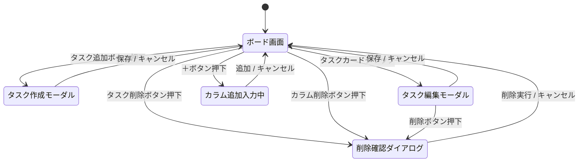
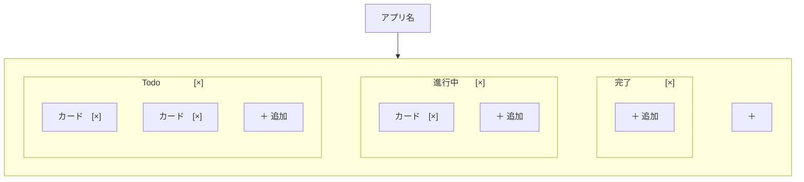
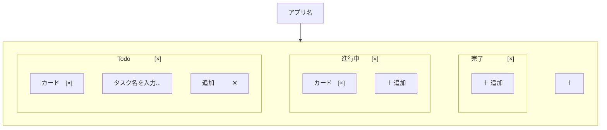
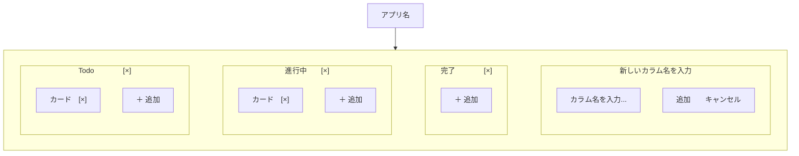
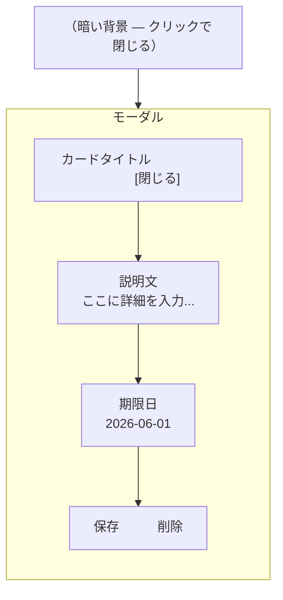

# 画面設計書

## タスク管理アプリ（Trello風）

| 項目 | 内容 |
|------|------|
| 作成日 | 2026-05-11 |
| バージョン | 1.0 |
| 作成者 | yusu |
| ステータス | 作成中 |

---

## 1. 画面一覧

| 画面ID | 画面名 | 説明 |
|--------|--------|------|
| S-01 | メインボード画面 | アプリのメイン画面。カラムとカードを表示する |
| S-02 | カード追加時 | カード追加の入力欄が表示された状態 |
| S-03 | カラム追加時 | カラム追加の入力フォームが表示された状態 |
| S-04 | カード詳細モーダル | カードをクリックしたときに開くモーダル（Phase 2以降） |

このアプリは1画面で完結する（ページ移動なし）。操作に応じてモーダルやダイアログが重なる形で表示される。

---

## 2. 画面遷移図

---

## 3. ワイヤーフレーム

### WF-01：メインボード画面（通常時）

| 要素 | 説明 |
|------|------|
| `[×]`（カラム右） | カラム削除ボタン |
| `カード [×]` | カードと削除ボタン |
| `＋ 追加` | カード追加ボタン |
| `＋`（右端） | カラム追加ボタン |

---

### WF-02：カード追加時

- `＋ 追加` を押すとカラム内に入力欄が出現する
- `追加`：確定ボタン（Enterキーでも同じ動作）
- `✕`：キャンセルボタン（入力欄を閉じる）

---

### WF-03：カラム追加時

- ボード右端の `＋` を押すと入力フォームがカラムとして出現する
- カラム名を入力して `追加` を押すと新しいカラムが追加される

---

### WF-04：カード詳細モーダル（Phase 2以降）

- カードをクリックすると画面中央にモーダルが開く
- 背景は暗くなり、モーダルに集中できる
- `閉じる` または背景クリックでモーダルを閉じる

---

## 4. デザイン方針

### カラーパレット

| 用途 | 方針 |
|------|------|
| 全体のトーン | パステルカラーを基調とする（淡く柔らかい色合い） |
| 配色の印象 | 男女問わず使いやすい、ニュートラルな印象 |
| 強調色 | 期限切れ警告など、必要な場面にのみ使用する |

### ボタン・UIコンポーネント

| 項目 | 方針 |
|------|------|
| ボタンのスタイル | フラット（平面）ではなく、立体感のある3Dスタイル |
| 操作感 | ボタンを押したときに「沈む」ようなアニメーションをつける |
| 全体の雰囲気 | 触って楽しい、使っていて気持ちいいUIを目指す |

### 初期表示カラム

アプリ起動時、以下の3カラムをデフォルトで表示する：

1. **Todo**（やること）
2. **進行中**（作業中）
3. **完了**（終わった）
